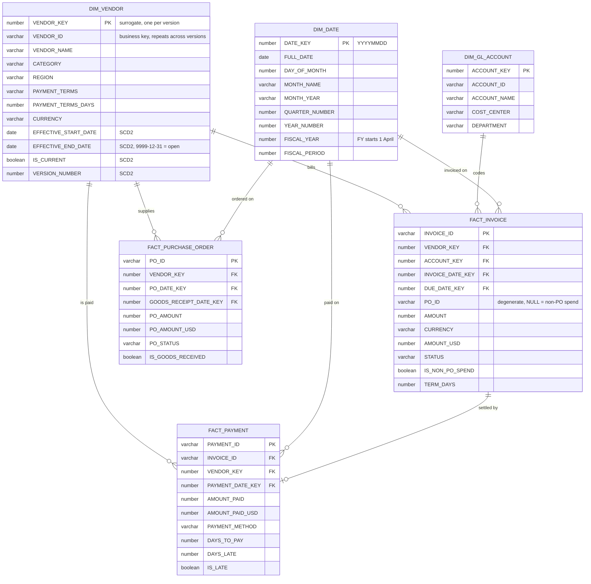

# Phase 4 — Gold Star Schema (ER Diagram)

Three facts, three dimensions. Every relationship is many-to-one from fact to dimension, which
is what makes this a star rather than a snowflake.

---

## Row counts as built

| Table | Rows | Note |
|---|---|---|
| `DIM_DATE` | 1,461 | 2024-01-01 → 2027-12-31, no gaps |
| `DIM_GL_ACCOUNT` | 20 | SCD Type 1 |
| `DIM_VENDOR` | **58** | for **52** vendors — 6 carry two versions |
| `FACT_PURCHASE_ORDER` | 480 | |
| `FACT_INVOICE` | 672 | 18 with `PO_ID IS NULL` |
| `FACT_PAYMENT` | 584 | |

---

## Reading the diagram

### Why `DIM_VENDOR` has two keys

`VENDOR_KEY` is the surrogate primary key — **one per version**. `VENDOR_ID` is the business key
and deliberately repeats: `V0001` appears twice, once for each set of terms it has held.

Facts join on `VENDOR_KEY`. Each fact row was bound at load time to the version in effect on its
own transaction date, so `FACT_INVOICE → DIM_VENDOR` needs no date predicate and stays a clean
many-to-one.

Facts also carry `VENDOR_ID` so the range-join pattern (query 5.6) can be demonstrated directly,
and so anyone writing ad-hoc SQL has the key they would naturally reach for.

### Why `PO_ID` is a degenerate dimension

`FACT_INVOICE.PO_ID` points at `FACT_PURCHASE_ORDER`, which is fact-to-fact rather than
fact-to-dimension. That is intentional: a purchase order is a *transaction*, not a descriptive
attribute, so there is no `DIM_PURCHASE_ORDER` to build. The 3-way match (query 5.5) is a
fact-to-fact comparison by nature — it asks whether two transactions agree.

`PO_ID` is nullable, and a `NULL` means non-PO spend. That is the single relationship in the
model that deliberately does not resolve.

### The date dimension is used four ways

`FACT_INVOICE` alone references `DIM_DATE` twice — invoice date and due date. That matters in
Power BI, where only **one** relationship between a given pair of tables can be active at a
time. Invoice date will be the active one; due date becomes an inactive relationship activated
on demand with `USERELATIONSHIP`.

Modelling it any other way — a second date dimension, or flattening date attributes onto the
fact — would either duplicate the dimension or break time intelligence.

### Why `FACT_PAYMENT` carries its own `VENDOR_KEY` and date key

It could reach both through `FACT_INVOICE`. It does not, because Power BI would then need to
filter payments by traversing a fact table, which is slow and creates ambiguous filter paths.
Giving the payment fact its own conformed keys keeps every filter one hop from a dimension.

The `VENDOR_KEY` is *inherited from the invoice* rather than re-resolved at the payment date —
otherwise an invoice and its own payment could land under two different vendor versions whenever
a terms change fell between the two dates, and vendor totals would disagree between the two
facts.

---

## The SCD Type 2 history, concretely

Six vendors changed between the two extracts. Each produced a closed row and a new open row:

| Vendor | Version | Category | Terms | Effective from | Effective to | Current |
|---|---|---|---|---|---|---|
| V0001 | 1 | Raw Materials | NET30 | 2022-05-24 | 2025-09-09 | ✗ |
| V0001 | 2 | IT Services | NET45 | 2025-09-10 | 9999-12-31 | ✓ |
| V0002 | 1 | Logistics | NET45 | 2024-08-09 | 2025-11-08 | ✗ |
| V0002 | 2 | Logistics | 2/10 NET30 | 2025-11-09 | 9999-12-31 | ✓ |
| V0008 | 1 | Office Supplies | NET45 | 2024-08-16 | 2025-10-22 | ✗ |
| V0008 | 2 | Raw Materials | NET15 | 2025-10-23 | 9999-12-31 | ✓ |
| V0024 | 1 | Consulting | NET15 | 2022-09-30 | 2025-06-18 | ✗ |
| V0024 | 2 | Logistics | NET45 | 2025-06-19 | 9999-12-31 | ✓ |
| V0026 | 1 | Consulting | NET45 | 2023-10-22 | 2025-05-09 | ✗ |
| V0026 | 2 | Consulting | NET30 | 2025-05-10 | 9999-12-31 | ✓ |
| V0043 | 1 | IT Services | NET30 | 2024-01-16 | 2025-09-24 | ✗ |
| V0043 | 2 | IT Services | NET15 | 2025-09-25 | 9999-12-31 | ✓ |

Each version ends **the day before** the next begins. Ranges abut without overlapping, so the
range join returns exactly one row per invoice — verified at 0 overlaps and 0 gaps.

**40 of 672 invoices bind to a non-current version.** That number is the real proof: it means
those invoices report against the terms that applied *at the time*, not today's terms. A
dimension with the SCD2 columns but every fact pointing at the current row would look identical
in the schema diagram and be worthless in practice.
